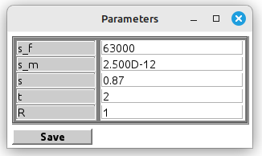

# CPMOT
## CPMOT software package
The **C**omposite **P**roperties **MO**deling **T**ools (**CPMOT**) package
contains programs for modeling and testing composite material property
models. The modeling programs include programs for manual and automatic
fitting of model parameters. The testing programs perform quantitative
estimation of the accuracy of the composite property model on a large
amount of experimental data. With the help of testing programs, it is
possible to evaluate and compare models. The software has been created
using the numerical modeling environment **Scilab**.

## Project File Structure

The file structure of the CPMOT project is shown in Figure 1

  
***Figure 1. File structure of the CPMOT project***

The **autoFit** directory contains programs for modeling the properties
of composite materials using numerical optimization to fit the model
parameters.

The **config** folder contains configuration files for numerical methods
used in modeling and testing.

The **data** directory contains files of experimental data of composite
materials properties as well as dataset list files.

The **manFit** directory contains programs for modeling composite
properties using a manual selection of model parameters.

The **results** folder contains the results of model testing.

The **models** directory contains mathematical models of composite
properties.

The **modelTest** folder contains the programs for testing the models.

The **shared** directory contains programs for working with lists of
input data, as well as modules of GUI, visualization, and numerical
methods used in the programs.

## Input data files and dataset lists

Input data files, text files with extension "**.inp**" contain
experimental dependences of electric conductivity or dielectric constant
of composite on the volume fraction of filler. The input data files also
include the units of measurement and the filler aspect ratio.
Additionally, the input data file may provide the electrical
conductivity or dielectric constant of the filler and the matrix, as
well as a description of the materials that form the composite and a
reference to the article in which the data was published.

To test models on multiple datasets, testing programs use dataset lists.
The dataset list is stored in a text file with the extension "**.lst**"
and contains the names of the input data files. The following programs
are used to create dataset lists: **makeListInpFiles**,
**splitListAR.sce**, and **splitListPrprt.sce**.

Additional information can be found in the description of The Collection
of Experimental Data on Composite Properties (CEDCP)
<https://github.com/yuak/CEDCP>.

## Programs for manual and automatic model fitting

Programs for manual and automatic fitting of model parameters are
located in the **manFit** and **autoFit** directories, respectively.
These programs are designed to fit model parameters to a single dataset.
While manual fitting programs are more flexible, and faster, automatic
fitting programs help to determine the optimal model parameters. The
simple graphical interface of the programs, shown in Figure 2, allows the
user to open the selected input file with experimental data, set model
parameters such as the conductivity or dielectric constant of the
filler, matrix, and interface layer, plot the model curve, and save the
fitted parameters and model curve data to a file. For an automatic
fitting program, the user can also select the optimization algorithm and
the error by which the fitting will be performed. Two algorithms are
currently implemented: constrained optimization by the genetic algorithm
and unconstrained optimization by the Nelder-Mead method. Options for
fitting errors include mean residual, mean absolute, mean relative, and
mean logarithmic errors.

a) 
b) 

***Figure 2. Graphical user interface of the manual a), and automatic b)
fitting program***

The graphical interface of the automatic and manual fitting programs is
configurable to operate with either the conductivity or the dielectric
constant of the composite. The program uses the "*units*" variable
specified in the input file to identify which composite property it is
processing.

When the program opens the input file, the parameter editing window is
filled with initial parameter values that can be further edited. The
initial parameter values can be default values specified in the program,
or they can be calculated based on data from the input file. For
example, the user can explicitly set the electrical conductivity of both
the matrix (*σ**m*) and filler (*σ**f*) in the
input file. However, these values may be ignored by the program if the
"propSetExplicity" flag is set to false. Instead, the initial
conductivity values will be evaluated from the input file data as
follows:

*σ**m*= min(*y**k*) and
*σ**f*= max(*y**k*), *k*= 1, 2, ... , *N*

where *y**k* is the value of electrical conductivity at the
*k*-th point of the dataset and *N* is the number of measurements in the
dataset.

The initial values for the fitting parameter boundaries required for
automatic fitting programs can also be either explicitly specified in
the program or calculated from data in the input file. For instance, the
boundaries for the electrical conductivity of the interface layer are
calculated as *σ**imin* = min(*σ**m*,
*σ**f*) and *σ**imax* = max(*σ**m*,
*σ**f*).

The user can save the results of manual or automatic model fitting to a
text file with the "**.dat**" extension. Such a file contains the
following information: model name, input data file name, values of fixed
model parameters, optimal values of fitting model parameters, fitting
error, and model curve data.

## Model testing programs

The model testing programs are designed to evaluate the accuracy of
composite property models. These programs perform the fit of a given
model to each dataset in the list and compute the model approximation
errors averaged over the list of datasets. In this manner, it is
possible to compare different models with each other or to evaluate a
model by comparing it with a reference model.

Testing programs do not have a graphical user interface. The program
begins by reading the names of input files that are specified in the
dataset list file. Then, the program opens each input file sequentially,
calculates the boundaries of the model fitting parameters, and performs
model fitting to each dataset. The fitting is conducted by constrained
optimization using a genetic algorithm. The program can be configured to
perform fitting by the mean residual, mean absolute, mean relative, and
mean logarithmic measures. To ensure the repeatability of results, a
forced reset of the random number generator is performed before the
start of each test.

Programs for testing models save the results in two formats. Firstly,
the programs create a text file **results.csv** in comma-separated
values format, which contains a table with the following data for each
dataset: dataset file name and values of the residuals, absolute,
relative, and logarithmic errors obtained as a result of testing. This
file format is convenient for further analysis and visualization of test
results using third-party programs. Secondly, testing programs create a
report file **results.html**, which contains the name of the model under
test, the results of fitting on each dataset including the final table
similar to the one saved in the file **results.csv**, as well as the
total test results averaged over the list of datasets. The results of
fitting on a dataset also include the graph of dependence of composite
property on filler volume fraction built by this model using optimal
parameters. Such a graph is saved in a separate file
**dataset_name.png** in graphical format. Thus, when testing a separate
model, **results.csv**, **results.html** files, and as many graphic
files are created as there are datasets included in the test. Therefore,
in order to organize the results of testing different models, when
testing the **model_Name** model, the program creates the **model_Name**
directory in the **results** directory.

## Programs for creating lists of input files

Several programs have been developed to create lists of input data.

The program **makeListInpFiles** creates a **listInpFiles.lst** file
containing a list of all "**.inp**" files located in the **data**
catalog.

The **splitListPrprt.sce** program divides the list of files with
experimental data into two lists: a list of dielectric permittivity
files, **permittivity.lst**, and a list of electrical conductivity
files, **elConductivity.lst**. The units of measurement specified in the
input file are used for this purpose.

The **splitListAR.sce** program divides the input data file list into
two lists according to the aspect ratio of the filler particles. The
first list, **spherical.lst**, contains input data files for cases of
composite containing spherical particle filler (AR=1). The second list,
**ellipsoidal.lst**, contains data files for cases of filler composed of
non-spherical particles (AR\<\>1).

Using a text editor, the user can create his own file with the list of
required input files by deleting unnecessary lines from the full list in
**listInpFiles.txt**.

If you use the CPMOT software package, please cite the following
publication

Kovalenko, Y., & Prokhorov, Y. (2023). Methods and tools for assessing
the accuracy of composite property models. Materials Today
Communications. <https://doi.org/10.1016/j.mtcomm.2023.107956>
